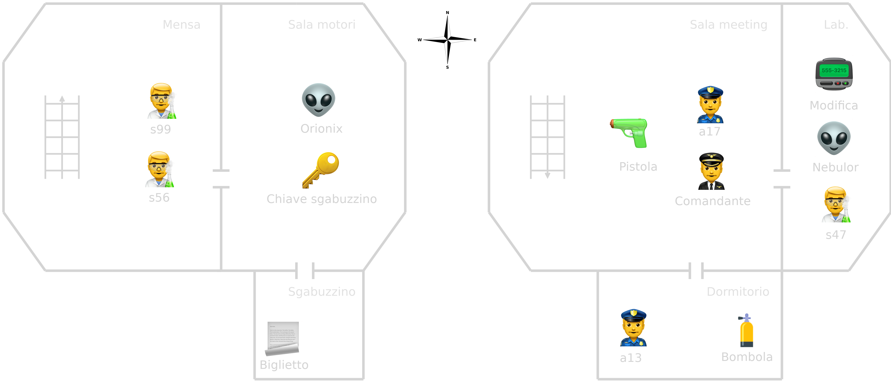

# Phosphorus textual-adventure 👽

Progetto finale per il corso di Metodi Avanzati di Programmazione [Uniba](https://www.uniba.it/it/ricerca/dipartimenti/informatica).

**Documentazione completa**: [Report](docs/Report.pdf)

## Trama 🪐

Il protagonista, l’agente f24, si trova su di una navicella spaziale di ritorno alla Terra da una missione che ha consistito nel catturare alieni per produrre il fosforo necessario alla sopravvivenza del pianeta, infatti, sulla quest'ultima, il fosforo, che riveste un ruolo fondamentale per la sopravvivenza dei vegetali e quindi per il sostentamento dell’uomo  è cominciato a diminuire drasticamente, per questo si organizzano spedizioni per catturare alieni in grado di produrlo.

Inizialmente, f24 si sveglierà dal sonno criogenico nel dormitorio con un ordine, impartito dal comandante, di indagare sulla misteriosa scomparsa di due alieni prigionieri. Il protagonista cercherà i due fuggitivi, districandosi tra le stanze dell’astronave ed interrogando i membri dell’equipaggio, fino a scoprire cosa viene fatto agli alieni prigionieri. Sarà solo a lui decidere se mantenere lo _status quo_ o ribellarsi.

## Mappa di gioco 🗺️



## Requisiti 📜
- [**Java**](https://www.java.com) v11 o versioni successive.

## Uso 💪

Per giocare all'avventura segui questi step:

1. Assicurati di avere [Java](https://www.java.com) installato sul tuo sistema;
2. Effettua il download del file zip `Phosphorus-v1.0.zip` dalla sezione Releases di questo repository;
3. Estrai il file zip; 
4. Esegui il file jar all'interno della cartella estratta con un doppio click o ```java -jar Phosphorus.jar``` da terminale;
5. Goditi l'avventura.

## Manuale giocatore 🔮

### Comandi generali

- `inizia` oppure `i`: da il via all'avventura.
- `riprendi`: carica il salvataggio della sessione precedente.
- `musica`: disattiva o riattiva la musica di gioco.
- `comandi`: per una panoramica generale di tutto quello che puoi fare nel gioco.
- `esci`: per uscire dal gioco.
- `salva`: per salvare i progressi di gioco.
- `menu`: per ritornare al menù.

### Comandi di navigazione

- `nord` oppure `N`: per spostarti verso nord.
- `sud` oppure `S`: per spostarti verso sud.
- `est` oppure `E`: per spostarti verso est.
- `ovest` oppure `O`: per spostarti verso ovest.

### Comandi dell'Inventario
- `inventario` oppure `inv`: mostra l'inventario degli oggetti che hai a disposizione.
- `prendi {nome_oggetto}`: raccoglie un oggetto presente nella stanza e lo aggiunge al tuo inventario.

### Comandi di gioco

- `parla {nome_personaggio}`: per parlare ad un personaggio.
- `osserva`: per osservare l'ambiente cicostante.
- `spara {nome_personaggio}`: per eliminare un nemico.
- `mappa`: per visualizzare la mappa del piano corrente.
- `sonda`: per visualizzare i valori relativi alla qualità dell'aria di Bari.

## Organizzazione repository 📐

```
Phosphorus/
|
├── docs/
│   ├── Report.tex
│   ├── Report.pdf
│   └── ...
|
├── resources/
│   ├── music/
│   │   └── Short_circuit.wav
│   ├── saves/
│   │   └── sav.mv.db
│   ├── characters.json
│   ├── items.json
│   ├── rooms.json
│   └── stopwords
|
├── src/java/di/uniba/map
│   ├── game/
│   │   ├── AirQuality.java
│   │   ├── GameEngine.java
│   │   ├── GameTimer.java
│   │   ├── PhosphorusGame.java
│   │   └── SaveGame.java
│   ├── parser/
│   │   ├── Parser.java
│   │   └──  ParserOutput.java
│   ├── type/
│   │   ├── Action.java
│   │   ├── ActionType.java
│   │   ├── Character.java
│   │   ├── Enemy.java
│   │   ├── Inventory.java
│   │   ├── Item.java
│   │   ├── KeyItem.java
│   │   ├── Room.java
│   │   └── Weapon.java
│   ├── ui/
│   │   ├── JKeypad.java
│   │   └── UI.java
│   ├── App.java
│   └── Utils.java
│
├── pom.xml
├── README.xml
└── LICENSE
```
